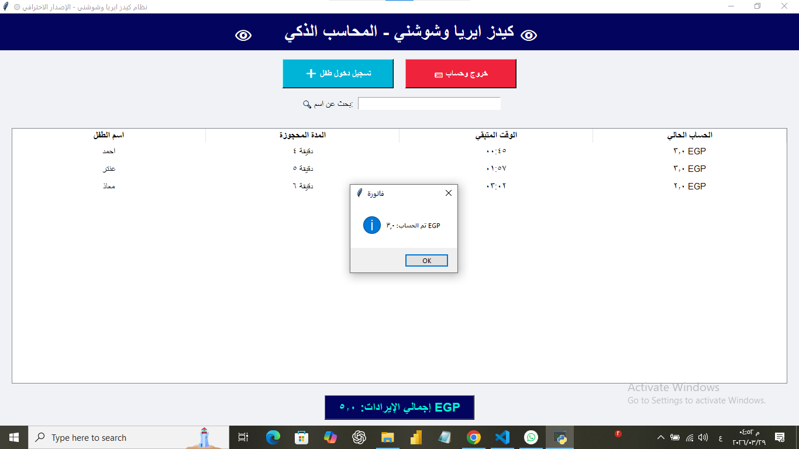
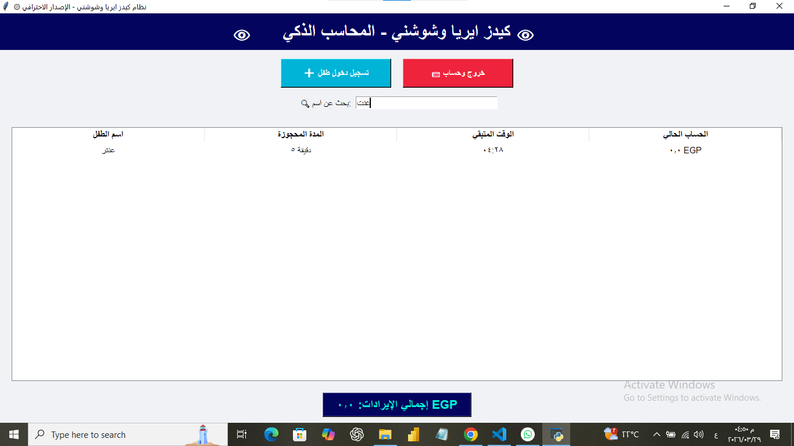

# 🟢 Kids Era Center - PRO (Accounting System)

A professional management and billing system for children's play areas, built with **Python**. This system handles real-time sessions, dynamic pricing, and data protection.

## 🚀 Key Features
- **Smart Billing:** Automatically calculates prices based on weekdays vs. weekends.
- **Data Safety:** Uses JSON checkpoints to prevent data loss during power outages.
- **Live Monitoring:** Real-time countdown timers with sound alerts using Python's `threading`.
- **Business Insights:** Automatically exports daily transactions to a CSV file for analysis.

## 🛠️ Built With
- **Python (Tkinter):** For the Graphical User Interface (GUI).
- **JSON & CSV:** For local database and logging.
- **Winsound & Threading:** For background alerts and notifications.

## 📸 Application in Action
Here is a preview of the main dashboard with live sessions, and the smart search filter in action:

  
  

---
*Developed with focus on real-world business logic and data integrity.*
